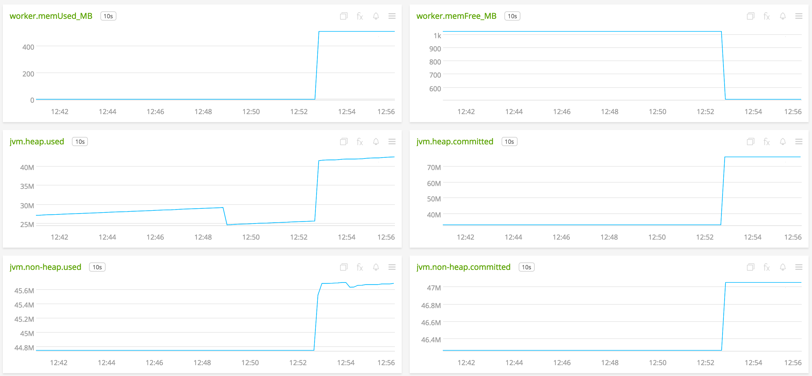
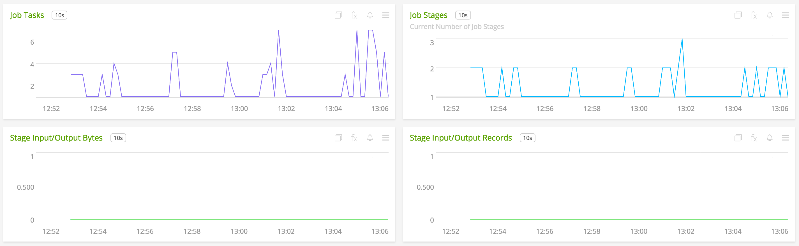
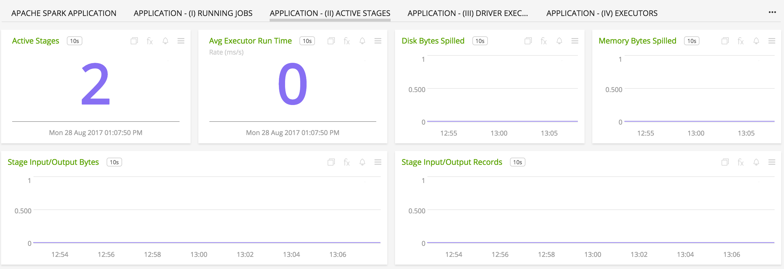

#  Apache Spark

#### FEATURES

##### Built-in dashboards

- **Spark Overview**: Overview of Spark cluster.

  

  

- **Master Process**: Overview of master process (data captured from Metrics sink).

  

  

- **Worker Process**: Overview of worker process (data captured from Metrics sink).

  

  

- **Spark Application**: Overview of data by Spark Application and user.

  

  

- **Running Jobs**: Overview of running jobs by Spark Application and user.

  

- **Active Stages**: Overview of active stages by Spark Application and user.

  

- **Driver**: Overview of driver executor by Spark Application and user.

  

- **Executors**: Overview of executors (excluding driver) by Spark Application and user.

  

- **Streaming Statistics**: Overview of streaming applications by Spark Application and user.

  

  

### USAGE

Sample of built-in dashboard in SignalFx:

### LICENSE

This integration is released under the Apache 2.0 license. See [LICENSE](./LICENSE) for more details.
