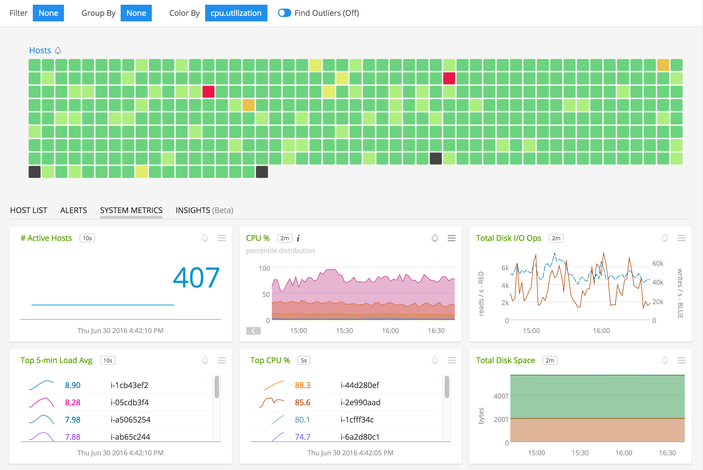
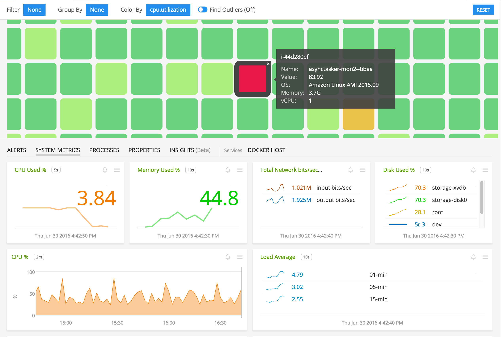

#  SignalFx Telegraf Agent

Metadata associated with the SignalFx Telegraf Agent can be found <a target="_blank" href="https://github.com/signalfx/integrations/tree/release/telegraf">here</a>. The code repository for this project can be found <a target="_blank" href="https://github.com/signalfx/telegraf/">here</a>.

- [Description](#description)
- [Requirements and Dependencies](#requirements-and-dependencies)
- [Features](#features)
- [Installation](#installation)
- [Configuration](#configuration)
- [License](#license)

### DESCRIPTION

<a target="_blank" href="https://github.com/influxdata/telegraf">Telegraf</a> is an open source daemon that collects statistics from a system and publishes them to a destination of your choice. You can use Telegraf to monitor infrastructure metrics, and enable Telegraf plugins that monitor a wide range of software.

#### FEATURES

Sending data using Telegraf allows you to take advantage of the following features:

- The <a target="_blank" href="https://docs.signalfx.com/en/latest/built-in-content/infra-nav.html">SignalFx Infrastructure page</a> visualizes hosts that are monitored using the SignalFx Telegraf Agent.

  [](./img/telegrafhostspage.png)

  [](./img/hostspagesinglehost.png)

- SignalFx provides <a target="_blank" href="http://docs.signalfx.com/en/latest/built-in-content/recommended-detectors.html">recommended detectors</a> for hosts instrumented with the SignalFx Telegraf Agent. These built-in templates allow you to instantly create intelligent detectors based on SignalFx’s powerful analytics.

- The SignalFx metadata plugin for Telegraf is a plugin that enriches your data by sending metadata about your hosts to SignalFx. This plugin is included by default in SignalFx’s Telegraf Agent.

### REQUIREMENTS AND DEPENDENCIES

The SignalFx Telegraf Agent is supported on the following operating systems:

| Operating System  | Version        |
|-----------|----------------|
| Amazon Linux | 2014.09, 2015.03, 2015.09, & 2016.03 |
| Debian  | 7 & 8 |
| RHEL/Centos | 6.x & 7.x |
| Ubuntu  | 12.04, 14.04, 15.04 & 16.04 |

### INSTALLATION

#### Install on a host

1.  Download the latest release of the <a target="_blank" href="https://github.com/signalfx/telegraf/releases">SignalFx Telegraf Agent</a> for your platform.
2.  Unzip the downloaded zip file.

        unzip Linux-x86_64.zip

3. Copy the binary `telegraf` to the location of your choosing.
4. This agent must be configured before it is run. To generate a configuration file for the agent, execute the `telegraf` binary with the option `config` and redirect it to a file named `telegraf.conf`:

        ./telegraf config > telegraf.conf

5. Modify the resulting configuration file to provide values that make sense for your environment, as described [below](#configuration).
6. Start the SignalFx Telegraf Agent, specifying the configuration file you generated in step 4.

        ./telegraf --config <path to the telegraf config file>

Note: This command only starts an executable. To ensure that the SignalFx Telegraf Agent starts as a background process at boot time, take additional steps as appropriate for your platform.

### CONFIGURATION

Edit the configuration file `telegraf.conf` as shown below to configure the agent for use with SignalFx.

#### Enable required plugins

By default, the following plugin sections are listed in the configuration file but commented out. Uncomment the following configuration sections to enable necessary plugins:
*  `[[inputs.net]]`
*  `[[inputs.signalfx-metadata]]`
*  `[[outputs.signalfx]]`
*  `[[aggregators.signalfx_util]]`

If you are not using InfluxDB, comment out the InfluxDB plugin configuration section `[[outputs.influxdb]]`.


### Configuring your endpoint

Before we can send metrics to SignalFx, we need to make sure you are sending them to the correct SignalFx realm.
To determine what realm you are in (YOUR_SIGNALFX_REALM), check your profile page in the SignalFx web application (click the avatar in the upper right and click My Profile).
If you are not in the `us0` realm, you will need to configure telegraf to send to the correct realm using the `DatapointIngestURL` and `EventIngestURL` configuration options, as shown below.

```
DatapointIngestURL: https://ingest.YOUR_SIGNALFX_REALM.signalfx.com/v2/datapoint
EventIngestURL: https://ingest.YOUR_SIGNALFX_REALM.signalfx.com/v2/event
```


#### Set configuration values

In `telegraf.conf`, provide values for the configuration options listed below that make sense for your environment.

| plugin block | configuration option | definition | example |
| ------ | ------------------ | ------- | -------- |
| [[outputs.signalfx]] | APIToken | Your SignalFx organization access token. | 'YOUR_SIGANLFX_API_TOKEN' |
| [[outputs.signalfx]] | DatapointIngestURL | The datapoint ingest endpoint you wish to send to. | `https://ingest.YOUR_SIGNALFX_REALM.signalfx.com/v2/datapoint` |
| [[outputs.signalfx]] | EventIngestURL | The event ingest endpoint you wish to send to. | `https://ingest.YOUR_SIGNALFX_REALM.signalfx.com/v2/event` |
| [[outputs.signalfx]] | Exclude | An array of metric names represented as strings that should not be sent to SignalFx | `["metric.name", "metric2.name"]` |
| [[outputs.signalfx]] | Include | An array of metric names represented as strings that should be sent to SignalFx.  By default all Non-SignalFx generated events (string type metrics) are disabled.  This array should be used to enable individual events. | `["metric.name", "metric2.name"]` |
| [agent] | logfile | Name of the desired logfile. Leave empty to log to `stderr`.  | 'logfile.log' |


### USAGE

To use the data transmitted by the SignalFx Telegraf Agent, check out the Infrastructure tab in SignalFx. On this page you'll find a visualization of all transmitting hosts, built-in dashboards to show the health of your infrastructure, and recommended detectors to send intelligent alerts.

#### Adding dimensions to all datapoints

You can add a dimension to every datapoint that Telegraf sends to SignalFx by including key='value' pairs in the `[global_tags]` block of the Telegraf configuration file. The following example adds dimensions `serverType=API` and `tier=middleware` to every datapoint:
```bash
[global_tags]
  serverType='API'
  tier='middleware'
```

### METRICS

For documentation of the metrics and dimensions emitted by this plugin, [click here](./docs).

### LICENSE

This integration is released under the MIT license. See [LICENSE](./LICENSE) for more details.
