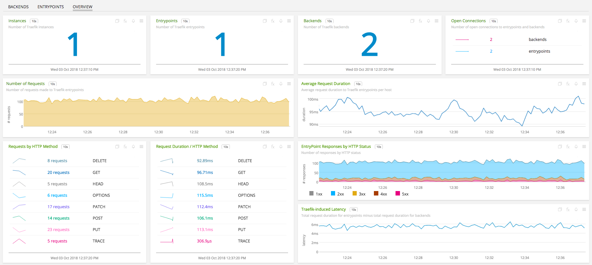
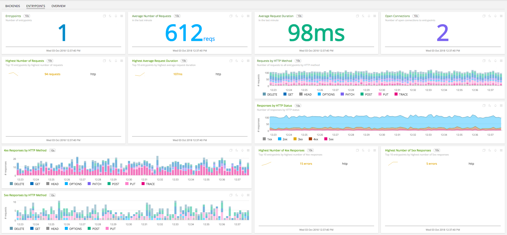
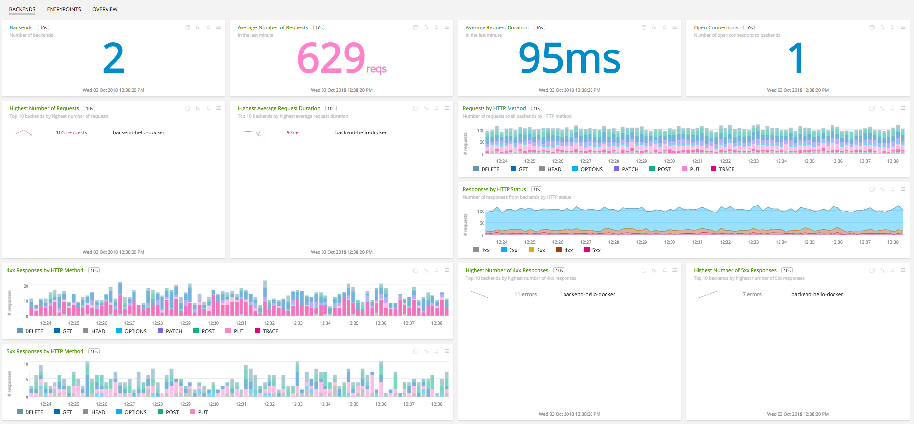

#  Traefik

- [Description](#description)
- [Requirements and Dependencies](#requirements-and-dependencies)
- [Installation](#installation)
- [Configuration](#configuration)
- [Usage](#usage)
- [Metrics](#metrics)
- [License](#license)

### DESCRIPTION

Configure <a target="_blank" href="https://docs.traefik.io/configuration/metrics">Traefik</a> to expose internal metrics as prometheus metrics at an endpoint. Install the <a target="_blank" href="https://github.com/signalfx/signalfx-agent">SignalFx Smart Agent</a> and configure it to access SignalFx and use the <a target="_blank" href="https://github.com/signalfx/signalfx-agent/blob/9feb3f77fdf6de46dc476f62568ad4f9b725660c/docs/monitors/prometheus-exporter.md">prometheus-exporter</a> monitor.

### REQUIREMENTS AND DEPENDENCIES

| Software          | Version        |
|-------------------|----------------|
| signalfx-agent    |     3.4+       |

### INSTALLATION

Follow these steps to install this plugin:

1. Install the <a target="_blank" href="https://docs.signalfx.com/en/latest/integrations/agent/index.html">SignalFx Smart Agent</a> in your environment.
2. Modify the Smart Agent configuration file as described in [Smart Agent Configuration](#smart-agent-configuration), below.
3. Configure Traefik to expose Prometheus metrics endpoint as described in [Traefik Configuration](#traefik-configuration), below.  

### CONFIGURATION
#### Traefik Configuration
Edit the Traefik configuration file, typically `traefik.toml`, to enable Traefik to expose <a target="_blank" href="https://docs.traefik.io/configuration/metrics/">prometheus metrics</a> at endpoint. The endpoint is on path `/metrics` by default. When running the Traefik binary, the configuration file is typically passed in as a command line argument.

`./traefik -c traefik.toml`

However, when running the Traefik Docker image, the configuration file is mounted to the volume `/etc/traefik/traefik.toml`. For example,


`docker run -d -p 8080:8080 -p 80:80 -v $PWD/traefik.toml:/etc/traefik/traefik.toml`

If the configuration file is not available use the <a target="_blank" href="https://raw.githubusercontent.com/containous/traefik/master/traefik.sample.toml">sample configuration file</a>. The Smart Agent must have network access to Traefik. This means for instance that, in a Docker environment, the Smart Agent container needs to share a network with the Traefik container. So the Docker run command to start the agent may look as follows:

Before we can send metrics to SignalFx, we need to make sure you are sending them to the correct SignalFx realm.
To determine what realm you are in (YOUR_SIGNALFX_REALM), check your profile page in the SignalFx web application (click the avatar in the upper right and click My Profile).
If you are not in the `us0` realm, you will need to set the `URL` configuration option below to use the correct realm, as shown below.

You will also need to set the `SFX_ACCESS_TOKEN` configuration option to your SignalFx organization access token (YOUR_SIGNALFX_API_TOKEN).
For more information on authentication, see the API's [Authentication documentation](https://developers.signalfx.com/basics/authentication.html).
```
docker run --rm \
-e SFX_ACCESS_TOKEN=YOUR_SIGNALFX_API_TOKEN \
-e SFX_INGEST_URL=https://ingest.YOUR_SIGNALFX_REALM.signalfx.com \
-v /var/run/docker.sock:/var/run/docker.sock \
-v <agent.yaml path>:/etc/signalfx/agent.yaml \
--net <traefik container network> \
quay.io/signalfx/signalfx-agent:<version>
```
#### Smart Agent Configuration

Find and edit the Smart Agent configuration file `agent.yaml` to enable the Docker observer and configure the prometheus-exporter monitor as described <a target="_blank" href="https://github.com/signalfx/signalfx-agent/blob/9feb3f77fdf6de46dc476f62568ad4f9b725660c/docs/monitors/prometheus-exporter.md">here</a>. For example, the configuration below will cause the Smart Agent to query the Docker Engine API for all running containers with port 8080 exposed and export Prometheus metrics from endpoint `<container ip>:8080/metrics`.

```
observers:
  - type: docker
monitors:
  - type: prometheus-exporter
    discoveryRule: port == 8080
  extraDimensions:
    metric_source: traefik
```
Also, metrics can be excluded by configuring the `metricsToExclude` section of the Smart Agent configuration file.

### USAGE

The Smart Agent exports Prometheus metrics exposed by Traefik. These metrics can be categorized into Traefik-related, entrypoint-related and backend-related metrics. The Traefik-related metrics are prefixed by `go_` and `process_`. The entrypoint-related metrics are prefixed by `traefik_entrypoint_` and the backend-related metrics prefixed by `traefik_backend_`.


The Traefik-related metrics are for monitoring Traefik itself. For instance, the `go_memstats_sys_bytes` metric can be used to plot Traefik memory usage. The entrypoint-related and backend-related key metrics are the number and duration of requests measured at entrypoints and backends. These metrics are used to compute measurements such as the average request duration.





The entrypoint-related and backend-related metrics also include metrics for the number of entrypoints connections, backends connections and backend server up/down flag.

### METRICS

For documentation of the metrics emitted, [click here](./docs).

### LICENSE

This integration is released under the Apache 2.0 license. See [LICENSE](https://github.com/signalfx/integrations/blob/master/traefik/LICENSE) for more details.
