#  VSphere

Metadata associated with SignalFx's VSphere integration can be found [here](https://github.com/signalfx/integrations/tree/release/signalfx-vsphere). The relevant code for the plugin can be found [here](https://github.com/signalfx/signalfx-vsphere).

- [Description](#description)
- [Requirements and Dependencies](#requirements-and-dependencies)
- [Installation](#installation)
- [Configuration](#configuration)
- [Usage](#usage)
- [Metrics](#metrics)
- [License](#license)

### DESCRIPTION

This is the SignalFx VSphere integration. It collects metrics from vCenter and reports metrics to SignalFx

#### FEATURES

##### Built-in dashboards

- **VCenter**: Overview of VCenter architecture from all Objects in the VCenter inventory.

  [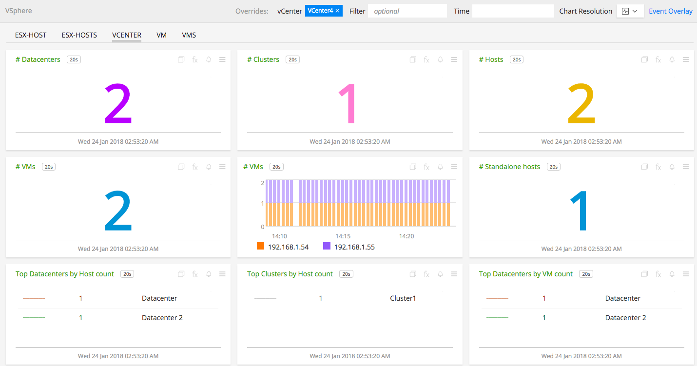](./img/dashboard_vsphere_vcenter_top.png)
  
  [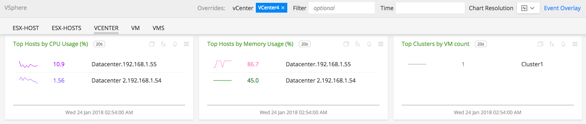](./img/dashboard_vsphere_vcenter_bottom.png)
  
- **ESX-Host**: Provides metrics for a single ESX-Host.

  [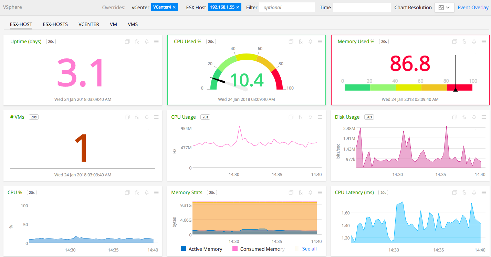](./img/dashboard_vsphere_esx_host_top.png)
  
  [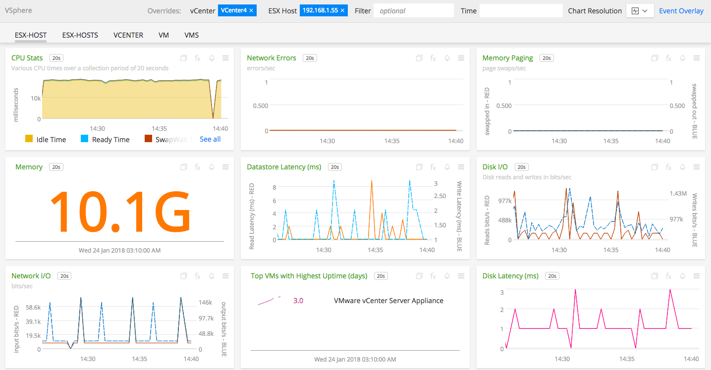](./img/dashboard_vsphere_esx_host_middle.png)

  [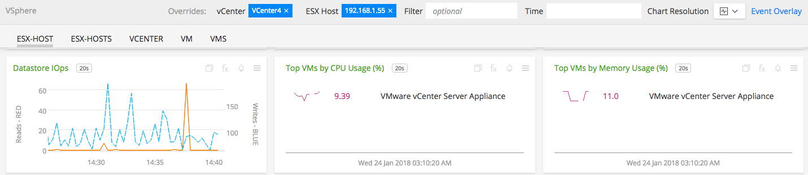](./img/dashboard_vsphere_esx_host_bottom.png)

- **ESX-Hosts**: Provides metrics for all the ESX-Hosts in VCenter.

  [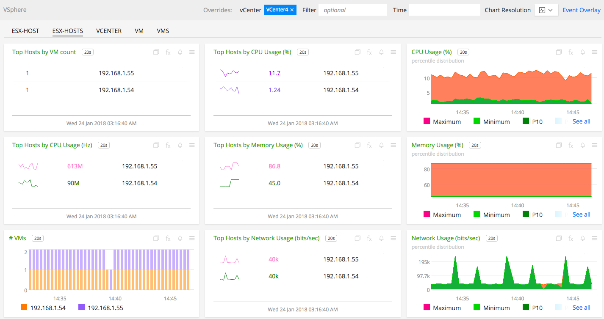](./img/dashboard_vsphere_esx_hosts_top.png)
  
  [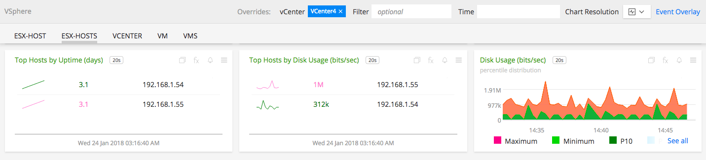](./img/dashboard_vsphere_esx_hosts_bottom.png)

- **VM**: Provides metrics for a single Virtual Machine.

  [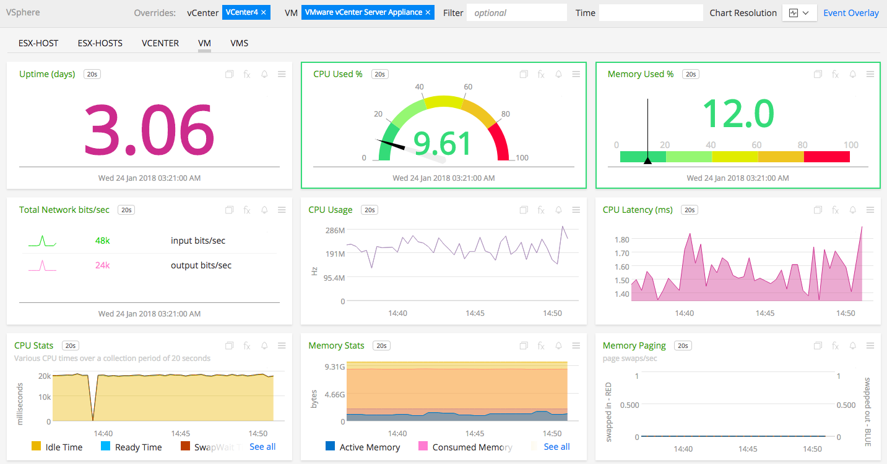](./img/dashboard_vsphere_vm_top.png)
  
  [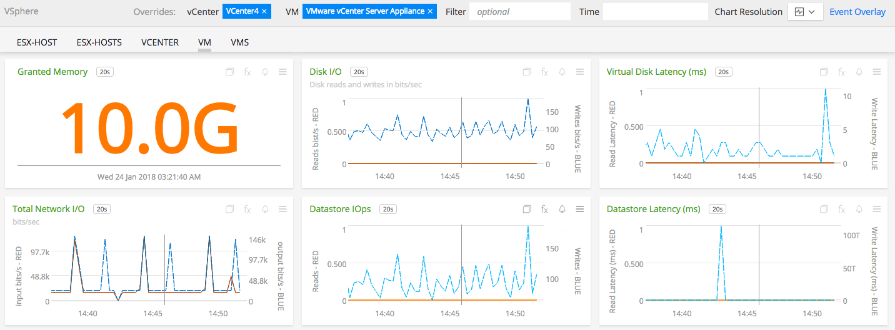](./img/dashboard_vsphere_vm_bottom.png)

- **VMs**: Provides metrics for all the Virtual Machines in VCenter.

  [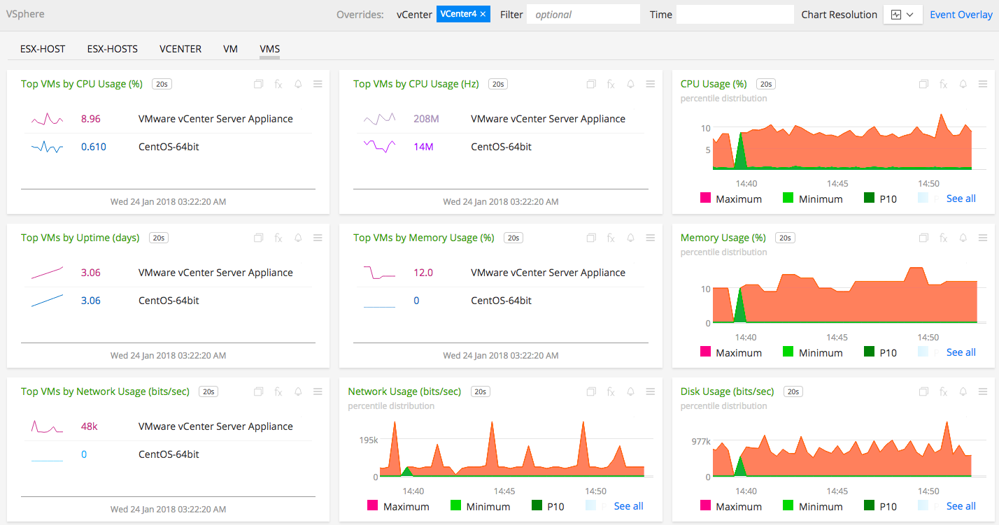](./img/dashboard_vsphere_vms.png)

### REQUIREMENTS AND DEPENDENCIES

#### Version information

| Software  | Version        |
|-----------|----------------|
| vcenter | 6.5 or later |


### INSTALLATION

1. Download the SignalFx-Vsphere monitoring application <a target="_blank" href="https://github.com/signalfx/signalfx-vsphere/releases/tag/v1.0.0/"> ovf template</a>.

2. Deploy the ovf template to the vCenter using a connected/configured vSphere client.

3. Login to the virtual machine . User : ```signalfx``` Password : ```signalfx```

4. Modify the sample configuration file located at ```/etc/vsphere/config.yaml``` as described in [Configuration](#configuration), below.

5. Restart the service by  ```$ service vsphere-monitor restart```

### CONFIGURATION

Using the example configuration file <a target="_blank" href="https://github.com/signalfx/integrations/tree/master/signalfx-vsphere/config.yaml">config.yaml</a> as a guide, provide values for the configuration options listed below that make sense for your environment and allow you to connect to the VCenter to be monitored.

| configuration option | definition | example value |
| ---------------------|------------|---------------|
| host | Hostname or IP address of the vCenter Server. | 192.168.1.60 |
| username | Username required to login to vCenter Server. | administrator@vsphere.local |
| password | Password required to login to vCenter Server. | Abcd123$ |
| Name | Name of the vCenter Server. | VCenter-Signalfx |
| IngestToken | SignalFx Ingest Token required to send metrics to ingest server. | rJWesf1235RTsffseuv |
| MORSyncInterval | Time interval at which the vCenter inventory should be synced. | 300 |
| MetricSyncInterval | Time interval at which the available metrics should be synced. | 300 |
| IngestEndpoint | The url of ingest endpoint to send to metrics. | https://ingest.signalfx.com |
| IncludeMetrics | Metrics required for different inventory objects can be included individually. Currently metrics can be added for datacenter, cluster, host and vm. | mem.usage.average |
| ExcludeMetrics | Metrics emitted from different inventory objects can be excluded individually. | mem.usage.average |

Example configuration:

```apache
config:
  - host: 192.168.1.60
    username: administrator@vsphere.local
    password: Abcd123$
    Name: VCenter4
    IngestToken: rJWesf1235RTsffseuv
    IngestEndpoint: 'https://ingest.signalfx.com'
    MORSyncInterval: 300
    MetricSyncInterval: 300
    IncludeMetrics:
      host:
        - mem.swapused.average
      cluster:
        - mem.usage.average

```

The application can be configured to collect metrics from multiple VCenters in the following manner.

```apache
config:
  - host: 192.168.1.60
    username: administrator@vsphere.local
    password: Abcd123$
    Name: VCenter4
    IngestToken: rJWesf1235RTsffseuv
    IngestEndpoint: 'https://ingest.signalfx.com'
    MORSyncInterval: 300
    MetricSyncInterval: 300
    IncludeMetrics:
      host:
        - mem.swapused.average
      cluster:
        - mem.usage.average

  - host: 192.168.1.20
    username: administrator@vsphere.local
    password: Abcd123$
    Name: 192.168.1.20
    IngestToken: rJWesf1235RTsffseuv
    IngestEndpoint: 'https://ingest.signalfx.com'
    MORSyncInterval: 20
    MetricSyncInterval: 60
    EncludeMetrics:
      host:
        - disk.usage.average
```


### USAGE

#### Interpreting Built-in dashboards

- **VCenter**:

  - **Number of Datacenters**: Total number of Datacenters in the VCenter.

    [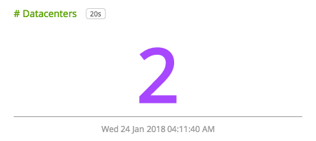](./img/chart_vsphere_vcenter_number_datacenters.png)

  - **Number of Clusters**: Total number of Clusters in the VCenter.

    [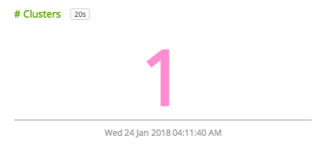](./img/chart_vsphere_vcenter_number_clusters.png)

  - **Number of Hosts**: Total number of Hosts in the VCenter.

    [](./img/chart_vsphere_vcenter_number_hosts.png)

  - **Number of VMs**: Total number of Virtual Machines in the VCenter.

    [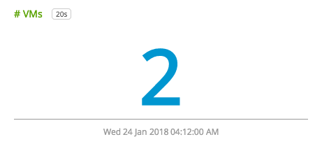](./img/chart_vsphere_vcenter_number_vms.png)

  - **Top Hosts by CPU Usage**: List of top hosts having highest CPU Usage 

    [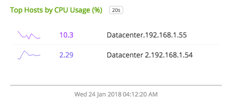](./img/chart_vsphere_vcenter_host_cpu.png)

  - **Top Hosts by Memory Usage**: List of top hosts having highest Memory Usage 

    [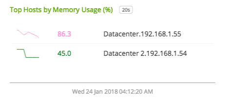](./img/chart_vsphere_vcenter_host_memory.png)


- **ESX-Host**:
  
  - **Up time**: Total uptime of ESX-Host in days.

    [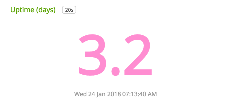](./img/chart_vsphere_esx_host_uptime.png)

  - **CPU Usage**: CPU Usage percentage of ESX-Host.

    [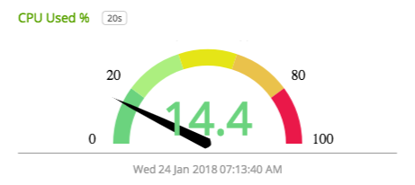](./img/chart_vsphere_esx_host_cpu_usage.png)

  - **Memory Usage**: Memory Usage percentage of ESX-Host.

    [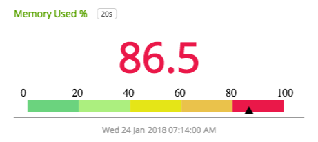](./img/chart_vsphere_esx_host_memory_usage.png)

  - **Disk Usage**: Disk Usage percentage of ESX-Host.

    [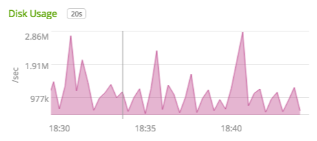](./img/chart_vsphere_esx_host_disk_usage.png)

  - **Network IO**: Network IO operations of ESX-Host in bits/sec.

    [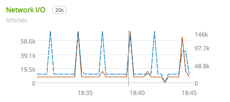](./img/chart_vsphere_esx_host_network_io.png)

  - **Number of VMs**: Total number of Virtual Machines in the ESX-Host.

    [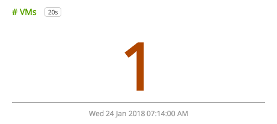](./img/chart_vsphere_esx_host_number_vms.png)


- **ESX-Hosts**:
  
  - **Top Hosts by VM count**: List of top Hosts having highest VM count.

    [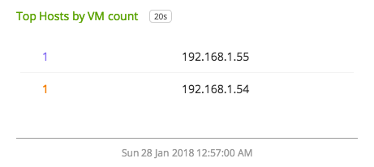](./img/chart_vsphere_esx_hosts_vm_count_top.png)

  - **CPU Usage**: Percentile distribution of CPU Usage of different Hosts in the VCenter.

    [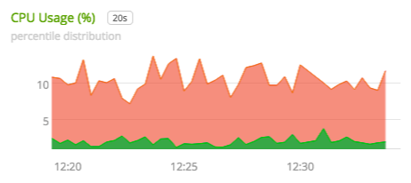](./img/chart_vsphere_esx_hosts_cpu_percentile.png)

  - **Memory Usage**: Percentile distribution of Memory Usage of different Hosts in the VCenter.

    [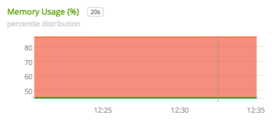](./img/chart_vsphere_esx_hosts_memory_percentile.png)

  - **Disk Usage**: Percentile distribution of Disk Usage of different Hosts in the VCenter

    [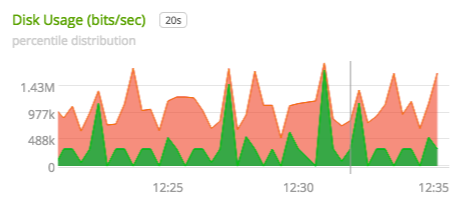](./img/chart_vsphere_esx_hosts_disk_percentile.png)

  - **Network IO**: Percentile distribution of Network Usage of different Hosts in the VCenter.

    [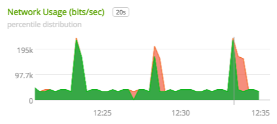](./img/chart_vsphere_esx_hosts_network_percentile.png)

  - **Number of VMs**: Stack chart of VM count of different Hosts present in the VCenter.

    [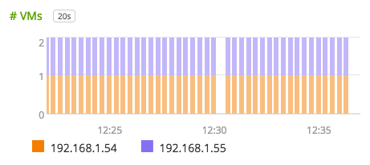](./img/chart_vsphere_esx_hosts_vm_count_stack.png)

  
- **VM**:
  
  - **Up time**: Total uptime of VM in days.

    [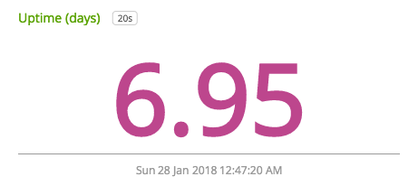](./img/chart_vsphere_vm_uptime.png)

  - **CPU Usage**: CPU Usage percentage of VM.

    [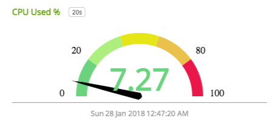](./img/chart_vsphere_vm_cpu_usage.png)

  - **Memory Usage**: Memory Usage percentage of VM.

    [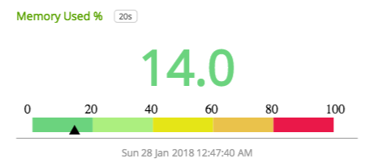](./img/chart_vsphere_vm_memory_usage.png)

  - **Disk Usage**: Disk Usage percentage of VM.

    [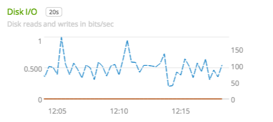](./img/chart_vsphere_vm_disk_usage.png)

  - **Network IO**: Network IO operations of VM in bits/sec.

    [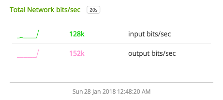](./img/chart_vsphere_vm_network_io.png)

  - **Datastore Latency**: Datastore latency of VM in seconds.

    [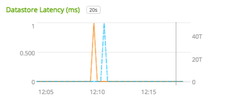](./img/chart_vsphere_vm_datastore_latency.png)
  
- **VMs**:
  
  - **CPU Usage**: Percentile distribution of CPU Usage of different VMs in the VCenter.

    [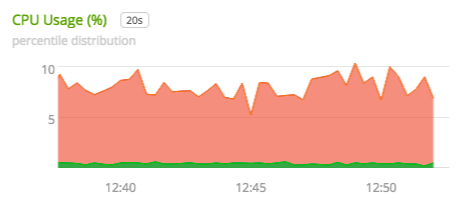](./img/chart_vsphere_vms_cpu_percentile.png)

  - **Memory Usage**: Percentile distribution of Memory Usage of different VMs in the VCenter.

    [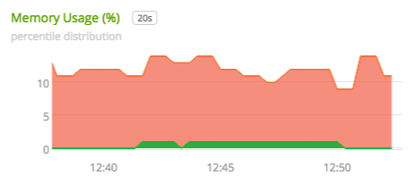](./img/chart_vsphere_vms_memory_percentile.png)

  - **Disk Usage**: Percentile distribution of Disk Usage of different VMs in the VCenter

    [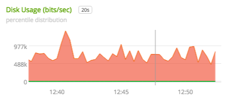](./img/chart_vsphere_vms_disk_percentile.png)

  - **Network IO**: Percentile distribution of Network Usage of different VMs in the VCenter.

    [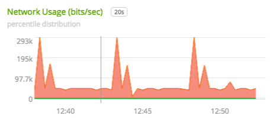](./img/chart_vsphere_vms_disk_percentile.png)

  - **Up time**: List of top VMs having highest uptime in the VCenter.

    [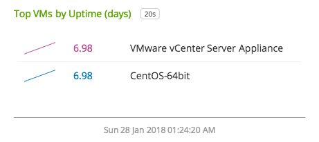](./img/chart_vsphere_vms_uptime_top.png)

### METRICS

For documentation of the metrics and dimensions emitted by this plugin, [click here](./docs).

### LICENSE

This integration is released under the Apache 2.0 license. See [LICENSE](./LICENSE) for more details.
