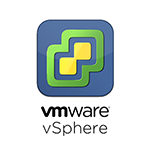
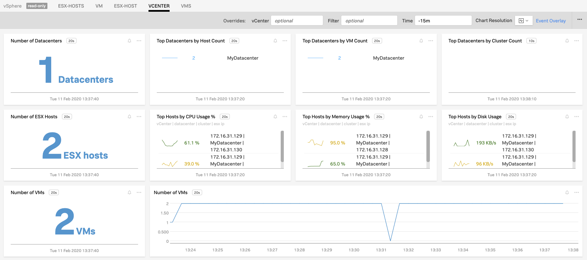
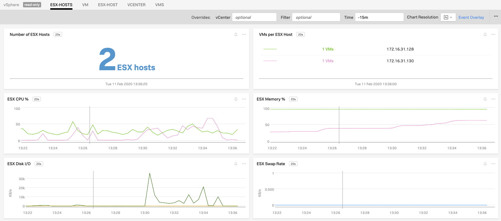
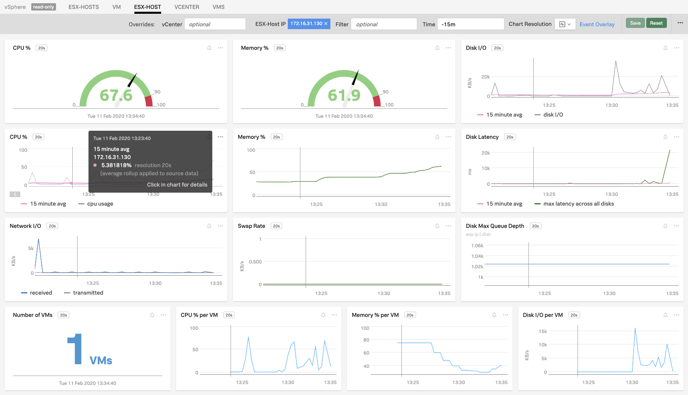
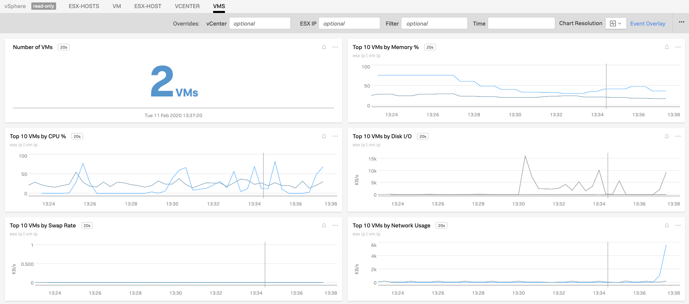
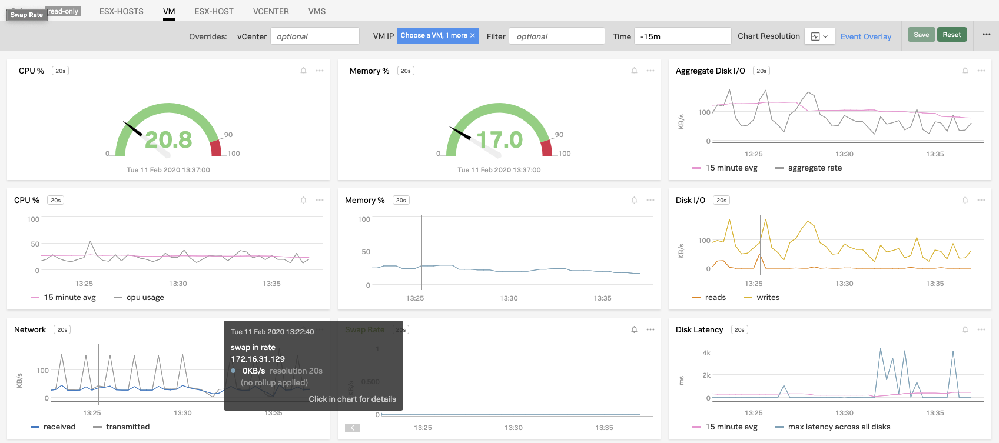

#  vSphere

#### FEATURES

##### Built-in dashboards

- **vCenter**: Overview of vCenter.

  
  
- **ESX-Hosts**: Metrics for all ESX Hosts.

  
  
- **ESX-Host**: Metrics for a single ESX Host.

  
  
- **VMs**: Metrics for all Virtual Machines.

  

- **VM**: Metrics for a single Virtual Machine.

  
