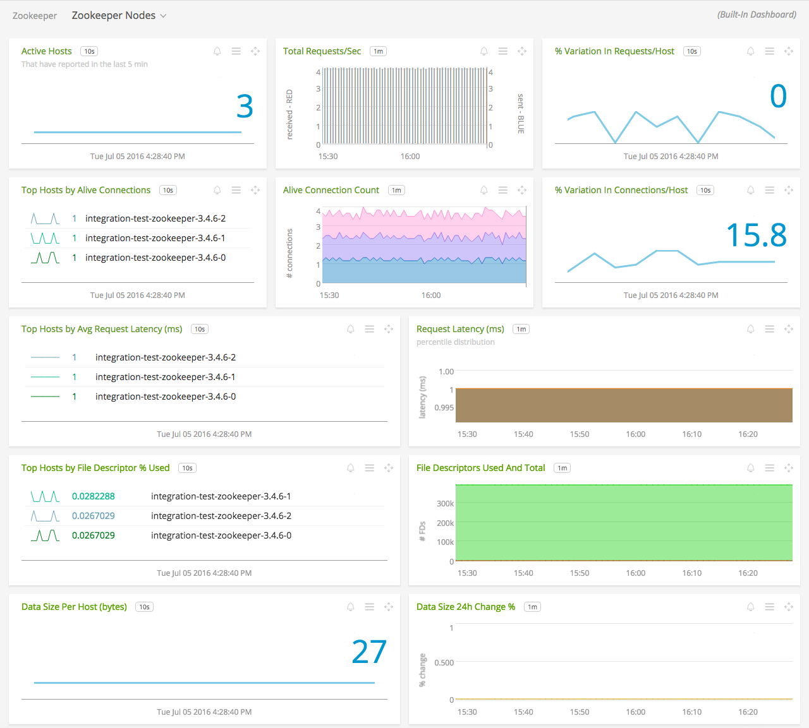
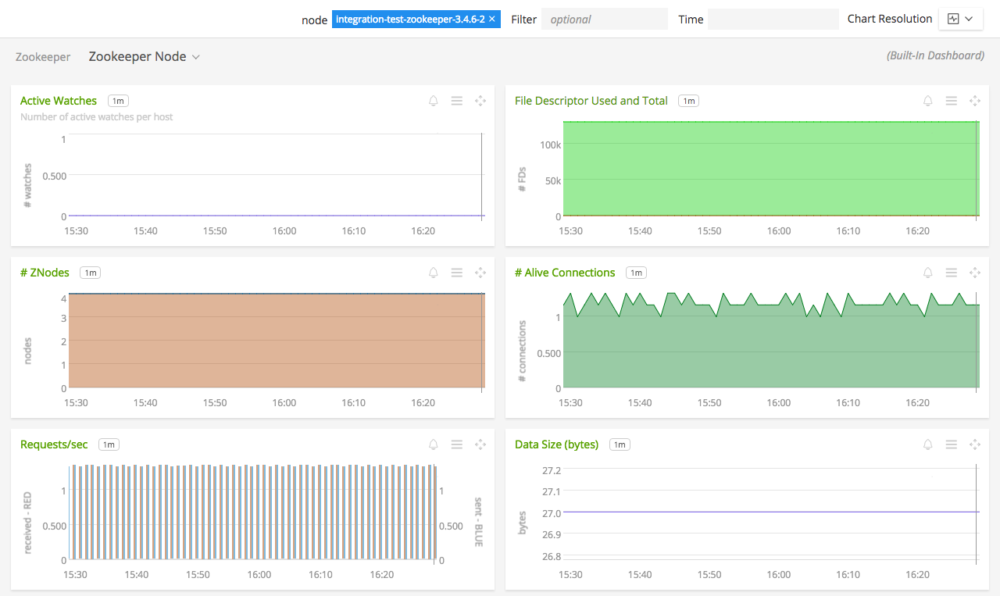

#  Zookeeper

#### FEATURES

##### Built-in dashboards

- **Zookeeper Nodes**: Overview of data from all Zookeeper nodes.

  

- **Zookeeper Node**: Focus on a single Zookeeper node.

    

### USAGE

Sample of built-in dashboard in SignalFx:

### METRICS

For documentation of the metrics and dimensions emitted by this plugin, [click here](./docs).

### LICENSE

This integration is released under the Apache 2.0 license. See [LICENSE](./LICENSE) for more details.
